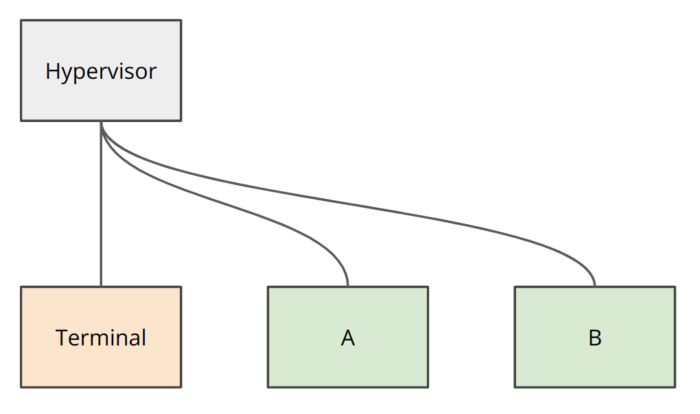
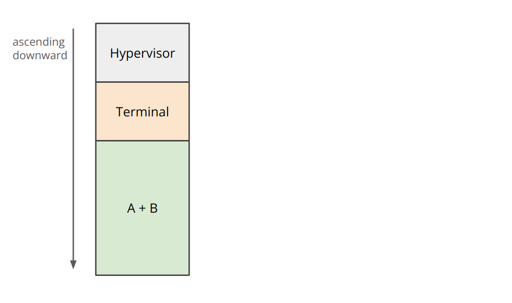
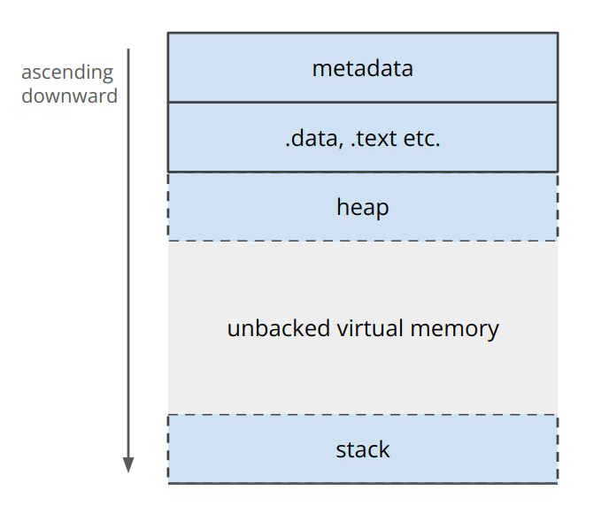

# Memory Management

BD0 is not for multi-user operating systems. As a result, we don't 
really need separation of kernel and userspace.

This allows for different abstractions of processes. BD0 suggests 
everything ought to be a thread and all threads exist in the same 
address space. 



BD0 will have a single address space, and never switch out the page 
table. Note that the virtual address space is huge, we have `1 << 48` 
bytes of addressable memory. To start a new process, a kernel-call* is
made with a requested size. The hypervisor the lays out processes one
after another in memory as below. BD0 will expose various kernel-calls
to access the start pointers of other processes.



For example, consider a process that knows it will not exceed 32GB of
memory, a user could start this process with some kind of kernel-call,
which could be accessed through a terminal.

```
start hello_world -L 32GB
```

This would lazily back a contiguous region of 32GB for this thread. 
These regions are all laid out in a deterministic way. The heap grows
ascending and the stack descending. 



As a result, stacks can grow as large as you like and heap management 
becomes very simple. The user can request the heap pointer with a
kernel-call, which can be implemented in a lock-free way. Proceses can
also just use the same memory region as another process, and we assume
that they correctly synchronize themselves. This is what the 'A + B' in
the earlier diagram represents.

## Benefits 

1. Interprocess communication is greatly simplified, with shared memory
   being the default.
2. Simplified OS structure, users can reason about what is actually
   happening more easily.

## Drawbacks

1. Spurious writes can have disastrous consequences for other processes,
   making things incredibly hard to debug. Solutions to run threads in
   debug-mode, where we trap writes exist, but are complex.
2. Lack of security is not an issue, since cross-process security is not
   a goal of BD0.

## Additional Considerations

Context switching requires minor adjustments, only slightly reducing the
thread state to exclude a new page table. There may be additional 
benefits to maintaining only a single page table.